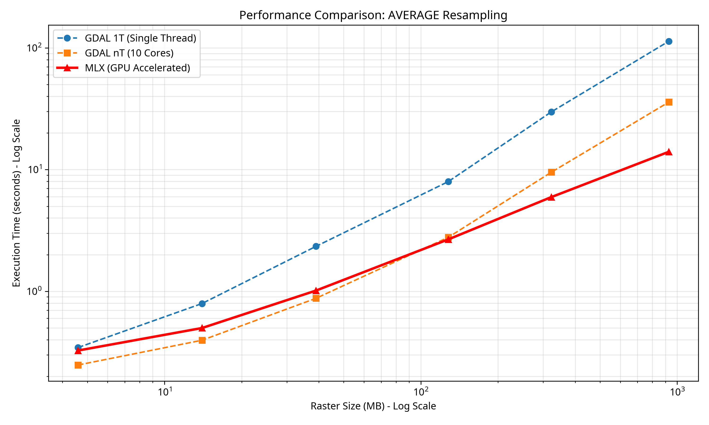

# MLX-Cog-Gen

MLX-accelerated Cloud Optimized GeoTIFF generator for Apple Silicon.

## About

mlx-cog-gen replaces GDAL's CPU-based pyramid/overview generation with an MLX implementation that runs on the Apple Silicon GPU. Everything else in the COG pipeline (tiling, compression, metadata) is handled by GDAL as usual.

**GDAL is a required system dependency.** This project links against the installed GDAL library and does not bundle it.

## Why Apple Silicon

On an x86 machine, GDAL's overview generation may or may not be leaving performance on the table depending on whether a discrete GPU is present. The behaviour varies by hardware configuration: some machines have it, some don't, and GDAL never uses it regardless.

On Apple Silicon the situation is deterministic. Every M-series device, from the base M1 MacBook Air to the M4 Mac Pro, ships with a high-performance GPU and Neural Engine in the same package as the CPU, sharing the same memory pool. GDAL uses none of it. The GPU is completely idle during the entire overview generation step on every Apple Silicon machine.

Apple Silicon has become the dominant platform for professional macOS users including a large portion of the geospatial community. Optimising this workflow for Apple Silicon means every one of those machines benefits, not a subset with a particular hardware configuration, but all of them unconditionally.

## Resampling methods

GDAL's default overview resampling is **NEAREST**, which picks one pixel from each 2×2 block and discards the rest. For continuous data (elevation, imagery, temperature), this throws away 75% of the signal at each level. A ridge that is one pixel wide at full resolution can disappear entirely at the next overview level depending on which pixel was selected.

`mlx_translate` supports two methods that avoid this.

### AVERAGE (default)

Every pixel in a 2×2 block contributes equally to the output:

```
out[i,j] = (src[2i,2j] + src[2i,2j+1] + src[2i+1,2j] + src[2i+1,2j+1]) / count_valid
```

This is a box filter, the simplest averaging kernel. It preserves signal energy across zoom levels and is the most widely used method in geospatial workflows for continuous rasters. The equal-weight 2×2 sum maps directly onto GPU array operations with no approximation.

### BILINEAR

Rather than averaging a fixed block, bilinear treats each output pixel as a point sample. The sample position for output pixel `i` in source space is:

```
x = (i + 0.5) * 2 - 0.5 = 2i + 0.5
```

This lands halfway between source pixels `2i` and `2i+1`. A tent filter (`w = 1 - |distance|`) then assigns weight 0.5 to each neighbour. Applied as two independent 1D passes (horizontal then vertical), the result for interior pixels at 2× is numerically the same as AVERAGE, but the model is different: interpolation at a point rather than integration over a region. The separable structure matches how GDAL implements bilinear and is the standard formulation used in image processing and GIS literature.

Bilinear is the most commonly requested alternative to AVERAGE in geospatial workflows. At higher-order methods (cubic, lanczos) the kernels grow larger and negative weights appear, making them less suitable as defaults but more accurate for certain data types.

## Limitations

**Float32 only.** `mlx_translate` reads all raster bands as Float32 and processes them as Float32 on the GPU. Other data types (Byte, UInt16, Int16, Float64) are accepted as input; GDAL converts them to Float32 on read. The implementation has only been tested with Float32 rasters. Precision loss is possible for integer types that exceed Float32's 23-bit mantissa (Int32, UInt32, Float64). Use `gdal_translate` for those data types.

**Memory.** `mlx_translate` loads each raster band fully into unified memory before dispatching to the GPU. This means **the uncompressed raster must fit within available system memory**. On Apple Silicon, CPU and GPU share the same memory pool, so available memory is whatever is free at runtime across both.

To estimate uncompressed size: `width × height × bands × bytes_per_pixel`. For a Float32 single-band raster that is 30000×30000, this is 30000 × 30000 × 1 × 4 = ~3.4 GB. For a uint16 RGB raster of the same dimensions it would be 30000 × 30000 × 3 × 2 = ~5.1 GB.

GDAL's approach processes in horizontal strips and handles arbitrarily large rasters. If your input exceeds available memory, use `gdal_translate` instead.

## Build

Install dependencies:

```bash
brew install gdal cmake mlx
```

Build and test:

```bash
mkdir build && cd build
cmake .. -DCMAKE_PREFIX_PATH=/opt/homebrew
make
ctest --output-on-failure
```

Three test suites run via `ctest`:

- `test_mlx`: verifies MLX install, GPU device access, and basic array ops
- `test_overview_dims`: verifies overview dimensions match GDAL's `ceil(N/2)` convention across even/odd/multi-level inputs
- `test_cog_stats`: runs both GDAL and MLX COG generation on a real DEM and checks that overview count matches exactly, file sizes are within 5%, and raster stats (min, max, mean, stddev) are within 5% at every overview level

## Usage

```bash
build/mlx_translate input.tif output_cog.tif
```

Outputs a COG with LZW compression and AVERAGE resampling by default. Pass `-r` to select a resampling method and `-co KEY=VALUE` to override creation options:

```bash
build/mlx_translate input.tif output_cog.tif -r BILINEAR
build/mlx_translate input.tif output_cog.tif -r AVERAGE -co COMPRESS=DEFLATE
```

Supported resampling methods: `AVERAGE` (default), `BILINEAR`.

## Benchmarks

Tested on an M1 Pro (16 GB), 5 runs per method. Rasters are Float32 single-band DEMs generated via TIN interpolation at six GSDs. GDAL 1T is the default single-threaded invocation; GDAL nT uses `ALL_CPUS` (10 cores). MLX pipeline uses parallel LZW tile compression (`GDAL_NUM_THREADS=ALL_CPUS`) for the final COG write.

**AVERAGE**

| Raster | Dimensions | File size | GDAL 1T | GDAL nT | MLX | vs GDAL 1T | vs GDAL nT |
|---|---|---|---|---|---|---|---|
| dem_160cm | 1873×1817 | 4.6 MB | 0.345s | 0.248s | 0.326s | 1.06× faster | 1.31× slower |
| dem_80cm | 3746×3634 | 14 MB | 0.793s | 0.396s | 0.499s | 1.59× faster | 1.26× slower |
| dem_40cm | 7491×7268 | 39 MB | 2.341s | 0.876s | 1.014s | 2.31× faster | 1.16× slower |
| dem_20cm | 14982×14536 | 128 MB | 7.974s | 2.778s | 2.671s | 2.98× faster | 1.04× faster |
| dem_10cm | 29967×29074 | 323 MB | 29.814s | 9.519s | 5.947s | 5.01× faster | 1.60× faster |
| dem_5cm | 59927×58141 | 928 MB | 113.549s | 35.896s† | 14.011s | 8.10× faster | 2.56× faster |

**BILINEAR**

| Raster | Dimensions | File size | GDAL 1T | GDAL nT | MLX | vs GDAL 1T | vs GDAL nT |
|---|---|---|---|---|---|---|---|
| dem_160cm | 1873×1817 | 4.6 MB | 0.351s | 0.248s | 0.324s | 1.08× faster | 1.30× slower |
| dem_80cm | 3746×3634 | 14 MB | 0.832s | 0.405s | 0.503s | 1.65× faster | 1.24× slower |
| dem_40cm | 7491×7268 | 39 MB | 2.446s | 0.914s | 1.015s | 2.41× faster | 1.11× slower |
| dem_20cm | 14982×14536 | 128 MB | 9.004s | 3.076s | 2.803s | 3.21× faster | 1.10× faster |
| dem_10cm | 29967×29074 | 323 MB | 33.944s | 9.870s | 5.930s | 5.72× faster | 1.66× faster |
| dem_5cm | 59927×58141 | 928 MB | 129.143s | 36.508s | 14.472s | 8.92× faster | 2.52× faster |

† 2 of 5 runs excluded (machine sleep caused 691s and 842s outliers); average computed from 3 valid runs.

| AVERAGE | BILINEAR |
|---|---|
|  |  |

MLX beats GDAL nT starting at dem_20cm (128 MB) and wins by **2.56×** (AVERAGE) and **2.52×** (BILINEAR) at dem_5cm (~60k×58k pixels). MLX is slower than GDAL nT at raster sizes below ~128 MB where Metal kernel launch overhead dominates over GPU compute time. MLX average and MLX bilinear run in nearly identical time since the GPU parallelises both uniformly.

## Roadmap

- Additional resampling algorithms (cubic, lanczos)
- GPU-accelerated statistics computation (min, max, mean, stddev) across all overview levels
- GPU-accelerated tile block creation (512×512 blocking, currently delegated to GDAL)
- OOM detection and graceful fallback to GDAL

## Contributing

Open an issue before raising a PR. Describe what you want to do and why in as much detail as possible. Once there is agreement on the approach, go ahead and open the PR.

## License

[MIT](https://choosealicense.com/licenses/mit/)
